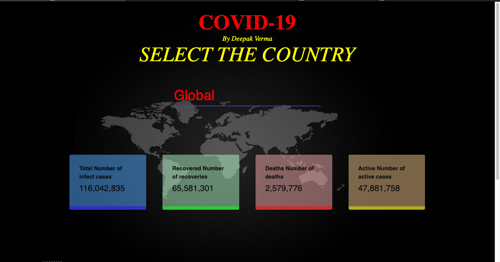
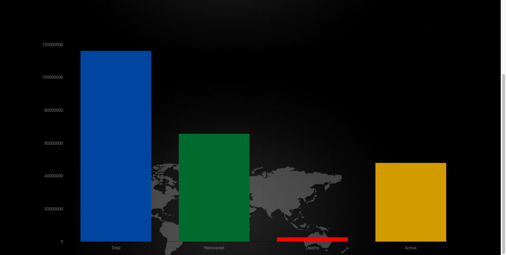

# covid19

 [COVID-19]
 This  aims to show the numbers & trends of people affected, recovered and deceased due to COVID19
​

## Technologies used

In the project directory, you can run:

 - [React](https://es.reactjs.org/) - Front-End JavaScript library
 - [Material UI](https://material-ui.com/) - React UI Framework
 - [react-chartjs-2](https://github.com/jerairrest/react-chartjs-2) - HTML5 Charts
 - [Axios](https://github.com/axios/axios) - Promise based HTTP client
 - [React CountUp](https://react-countup.now.sh/) - React component wrapper around CountUp.js
 - [Classnames](https://jedwatson.github.io/classnames/) - Conditionally joining classNames together
 


## Installation

To setup the app for development on your local machine , please follow the instruction below:


 1. Clone the repo to your machine
 ```bash
 git clone https://github.com/deepak783680/covid19.git
 ```
 
 2. Install necessary packages
   if you use npm 
 ```bash
 npm install
 ```
 
 3. Run  the development server
 ```bash
 npm start
 ```
 
 

 

